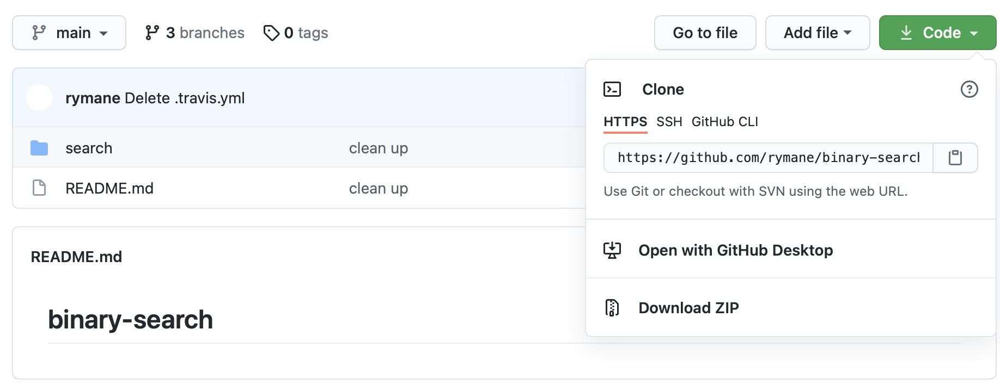

Before we begin this tutorial you should fork and clone the repo for this tutorial. 
Follow the instructions below. 

## Fork Github repo
Start by forking [this repo](https://github.com/rymane/binary-search/tree/project-start).
You fork the repo by clicking the link and then pressing the button right under your profile picture saying "fork". 

## Clone your repo
From your fork, press `Code` and select `HTTPS`. Copy the link.

Go to `/root` and run the following command in the terminal:

`git clone <your clone link here>`

Move into the repository: `cd binary-search`{{execute}}

Switch branch to "project-start": `git checkout project-start`{{execute}}

Great! Now we are ready to start the tutorial. 