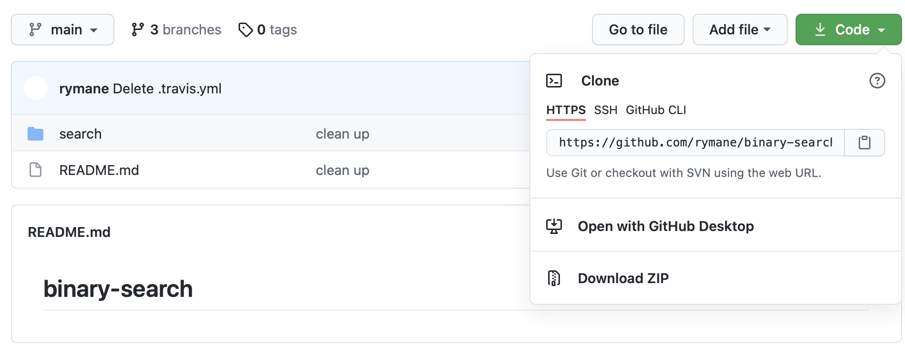

This far we have made a small Python project and written unit tests for it.
Now it is time to set up [Travis CI](https://www.travis-ci.com), which is
a service for continuous integrations, used to build and test our code automatically on every push.  

## Fork Github repo
Start by forking [this repo](https://github.com/rymane/binary-search/tree/project-start) to use in this step.
You fork the repo by clicking the link and then pressing the button right under your profile picture saying "fork". 

## Connect Travis with your GitHub account
First, you want to connect Travis CI to your GitHub account. 
1. Go to [Travis CI](https://www.travis-ci.com) and select **Sign up with GitHub**
2. Accept the authorization on your screen.
3. Either click **Activate all repositories using GitHub Apps** or go to your profile by pressing
the **profile picture**, then click **Settings**, and the green **Activate** button, and select the repositories you want to use with Travis CI.

## Clone your repo
From your fork, press `Code` and select `HTTPS`. Copy the link. 

Go to `/root` and run the following command in the terminal:

`git clone <your clone link>`

## Configure Travis
In order for Travis CI to work, the GitHub repo has to have a file named .travis.yml located in the root of the repository. 
Follow the instructions below to create the .travis.yml file.
 
Switch branch to "project-start": `checkout project-start` {{execute}}

Create the travis file: touch `.travis.yml`{{execute}}

### Set up .travis.yml file
Now, we add information about what language we are using for the project, and a script that makes Travis run the tests from the previous step with PyTests.

Click *Copy to Editor*.

<pre class="file" data-filename=".travis.yml" data-target="replace">
language: python
script: 
  - pytest
</pre>

The .travis.yml file will tell Travis which language is used together with the desired building and testing environment. If any dependencies has
to be installed before building the software, this is stated in the .travis.yml file as well. You can read more about the .travis.yml file [here](https://docs.travis-ci.com/user/tutorial/).

Since our project is small and does not have any dependencies, the above is everything needed in the .travis.yml file.
If this file was pushed to GitHub together with binarySearch and the tests, then for every push Travis
would run our code and test it automatically with our specified tests. For each commit, Travis will show
an orange dot while the build and tests are running, a green check mark if everything succeeded, and a red cross if something failed.

## Try it out
Add your newly added file to your GitHub repository: `git add .travis.yml` {{execute}}
Commit the changes: `git commit -m "added travis.yml file"`{{execute}}
Push your .travis.yml file: `git push`{{execute}}

Once that is done you can start making small changes in your repo. You can try editing the README 
or make small changes to binary search. Push your changes and see how Travis behaves. You can also look at the 
build in your Travis dashboard for more information. 