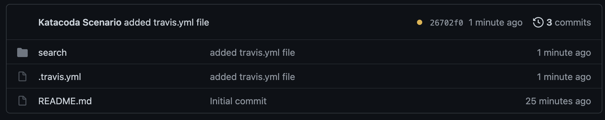
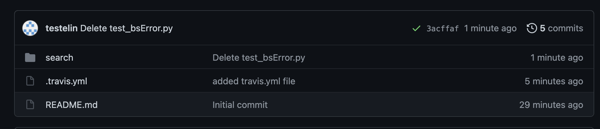
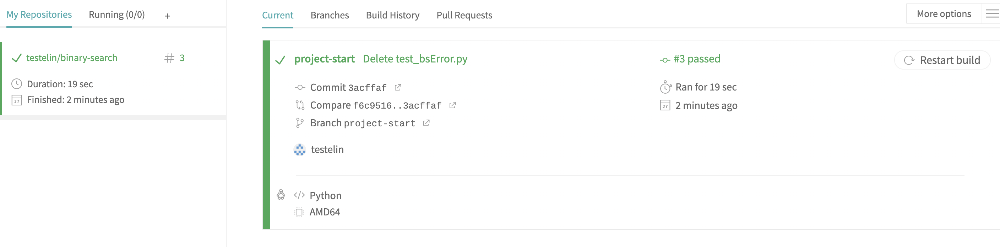
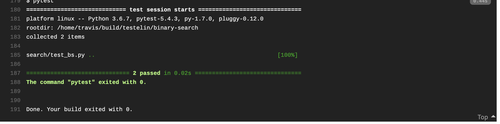

This far we have made a small Python project and written unit tests for it.
Now it is time to set up [Travis CI](https://www.travis-ci.com), which is
a service for continuous integrations, used to build and test our code automatically on every push.  

## Connect Travis with your GitHub account
First, you want to connect Travis CI to your GitHub account. 
1. Go to [Travis CI](https://www.travis-ci.com) and select **Sign up with GitHub**
2. Accept the authorization on your screen.
3. Either click **Activate all repositories using GitHub Apps** or go to your profile by pressing
the **profile picture**, then click **Settings**, and the green **Activate** button, and select the repositories you want to use with Travis CI.

## Configure Travis
In order for Travis CI to work, the GitHub repo has to have a file named .travis.yml located in the root of the repository. 
Follow the instructions below to create the .travis.yml file.

Create the travis file: `touch .travis.yml`{{execute}}

### Set up .travis.yml file
Now, we add information about what language we are using for the project, and a script that makes Travis run the tests from the previous step with PyTests.

Click `Copy to Editor`.

<pre class="file" data-filename="binary-search/.travis.yml" data-target="replace">
language: python
script: 
  - pytest
</pre>

The `.travis.yml` file will tell Travis which language is used together with the desired building and testing environment. If any dependencies has
to be installed before building the software, this is stated in the .travis.yml file as well. You can read more about the .travis.yml file [here](https://docs.travis-ci.com/user/tutorial/).

Since our project is small and does not have any dependencies, the above is everything needed in the .travis.yml file.
If this file was pushed to GitHub together with binarySearch and the tests, then for every push Travis
would run our code and test it automatically with our specified tests. For each commit, Travis will show
an orange dot while the build and tests are running, a green check mark if everything succeeded, and a red cross if something failed.

## Try it out
Add your newly added file to your GitHub repository: `git add .travis.yml`{{execute}}

Commit the changes: `git commit -m "added travis.yml file"`{{execute}}

Push your files: `git push`{{execute}}

Provide your username and password in order to push. 

Now go to the fork in your browser and change branch to `project-start` and see how travis is building. It should look like this:

After some time, when travis is done building it should look something like this:

(You can refresh the page to see the result faster)

You can also look at the build in your Travis dashboard for more information. 

Your travis dashboard will look something like this:

If you scroll down you can se the job log with details about the test. If something fails, you can get the details here:

## The end
Now you can continue to develop in this repo and every time you make a push, Travis
will help you out by automatically test your code and let you know when something is wrong.
